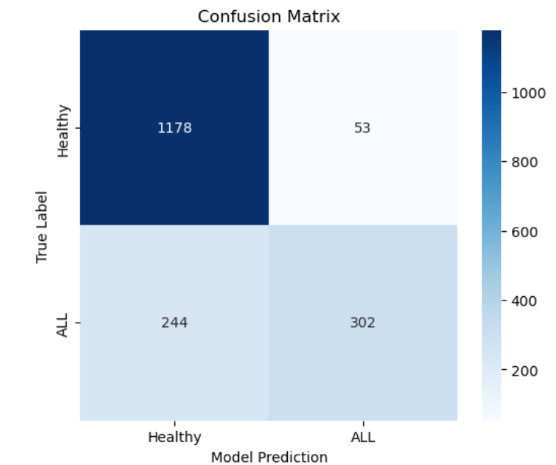

# Acute Lymphoblastic Leukemia Classification (ResNet50)

This repository contains a Deep Learning project focused on detecting leukemic lymphoblasts in blood smear images. As a Biomedical Engineering student, my goal was to take my first steps in the Medical AI field by building a CNN with clinical diagnostic purposes.

## Project Overview
The model uses a **ResNet50** backbone with **Transfer Learning**. The main challenge addressed was the morphological similarity between healthy and malignant cells, alongside significant class imbalance.

* **Final Accuracy:** 83.28%
* **Precision:** 85.04%
* **Specificity:** 96.00%
* **Sensitivity:** 55.82% 

## Files
* [**Accompanying Research Paper (PDF)**](./Acute%20Lymphoblastic%20Leukemia%20Classifier%20.pdf): Detailed analysis of the decisions made through the development of the model, results obtained and discussion. 
* [**Notebook**](./Acute%20Lymphoblastic%20Leukemia%20Classifier.ipynb): Documented Python code with TensorFlow/Keras.

## Training Strategy
The training was conducted in two stages: first training the top layers and then fine-tuning the entire network.

### Confusion Matrix
The matrix shows that while the model is excellent at detecting healthy cells (HEM), the sensitivity for leukemic cells (ALL) still has room for improvement (55.82%).

*Figure 1: Model performance across classes.*

## Author
**Marc Soria Ponseti** Biomedical Engineering (UB) | Deep Learning Enthusiast
